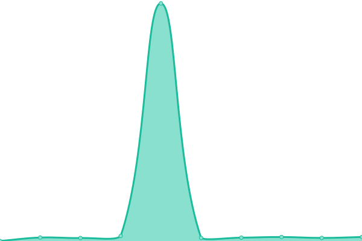

# [📈 Live Status](https://glytchClaw.github.io/serverupptime): <!--live status--> **🟧 Partial outage**

This repository contains the open-source uptime monitor and status page for [glytchClaw](https://glytchClaw.github.io/serverupptime), powered by [Upptime](https://github.com/upptime/upptime).

With [Upptime](https://upptime.js.org), you can get your own unlimited and free uptime monitor and status page, powered entirely by a GitHub repository. We use [Issues](https://github.com/glytchClaw/serverupptime/issues) as incident reports, [Actions](https://github.com/glytchClaw/serverupptime/actions) as uptime monitors, and [Pages](https://glytchClaw.github.io/serverupptime) for the status page.

<!--start: status pages-->
<!-- This summary is generated by Upptime (https://github.com/upptime/upptime) -->
<!-- Do not edit this manually, your changes will be overwritten -->
<!-- prettier-ignore -->
| URL | Status | History | Response Time | Uptime |
| --- | ------ | ------- | ------------- | ------ |
|  [Church Nextcloud](https://drive.gracesd.com) | 🟩 Up | [church-nextcloud.yml](https://github.com/glytchClaw/serverupptime/commits/HEAD/history/church-nextcloud.yml) | 

 568ms
     
 | 

<a href="https://glytchClaw.github.io/serverupptime/history/church-nextcloud">94.02%</a>
    

|  [Personal Nextcloud](https://drive.glynch.dev) | 🟥 Down | [personal-nextcloud.yml](https://github.com/glytchClaw/serverupptime/commits/HEAD/history/personal-nextcloud.yml) | 

 2929ms
     
 | 

<a href="https://glytchClaw.github.io/serverupptime/history/personal-nextcloud">99.50%</a>
    

|  [Jellyfin](https://movies.glynch.dev) | 🟩 Up | [jellyfin.yml](https://github.com/glytchClaw/serverupptime/commits/HEAD/history/jellyfin.yml) | 

 2654ms
     
 | 

<a href="https://glytchClaw.github.io/serverupptime/history/jellyfin">99.51%</a>
    

|  [BabyBuddy](https://ren.glynch.dev) | 🟩 Up | [baby-buddy.yml](https://github.com/glytchClaw/serverupptime/commits/HEAD/history/baby-buddy.yml) | 

 2280ms
     
 | 

<a href="https://glytchClaw.github.io/serverupptime/history/baby-buddy">99.52%</a>
    

|  [Website](https://website.glynch.dev) | 🟩 Up | [website.yml](https://github.com/glytchClaw/serverupptime/commits/HEAD/history/website.yml) | 

 2476ms
     
 | 

<a href="https://glytchClaw.github.io/serverupptime/history/website">99.54%</a>
    

|  [Immich](https://photos.glynch.dev) | 🟩 Up | [immich.yml](https://github.com/glytchClaw/serverupptime/commits/HEAD/history/immich.yml) | 

 2121ms
     
 | 

<a href="https://glytchClaw.github.io/serverupptime/history/immich">98.43%</a>
    

<!--end: status pages-->

[**Visit our status website →**](https://glytchClaw.github.io/serverupptime)

## 📄 License

- Powered by: [Upptime](https://github.com/upptime/upptime)
- Code: [MIT](./LICENSE) © [Anand Chowdhary](https://anandchowdhary.com), supported by [Pabio](https://pabio.com)
- Data in the `./history` directory: [Open Database License](https://opendatacommons.org/licenses/odbl/1-0/)
